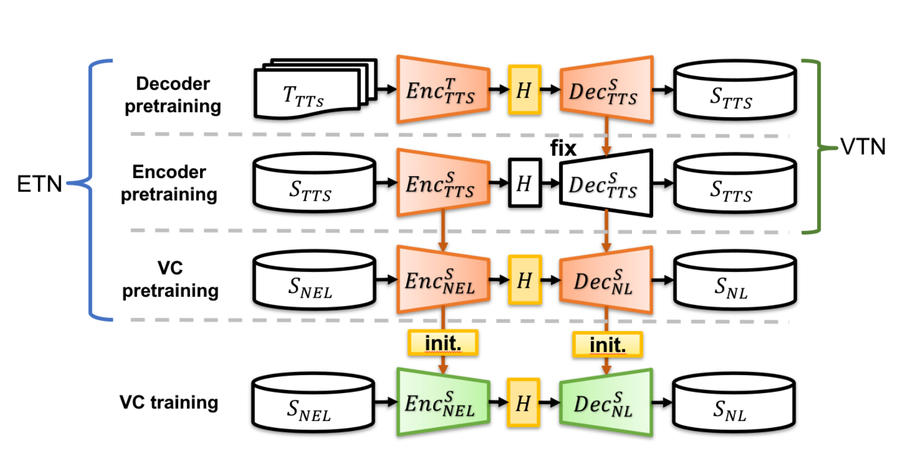
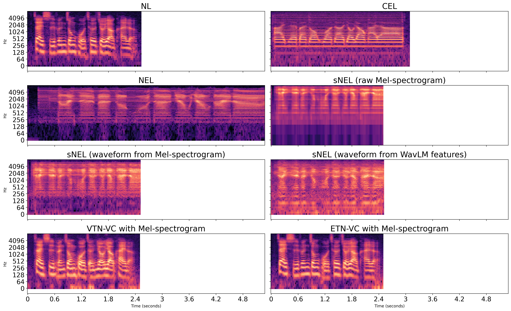

# Improving Nasal Electrolaryngeal Speech Using Voice Conversion

## Abstract
<!-- 本研究探討兩種電子喉語音——頸部電子喉（CEL）與鼻部電子喉（NEL）在語音轉換任務中的表現。CEL 為常見的替代發聲工具，但需將裝置貼於頸部使用，對於術後頸部傷口尚未癒合的喉切除患者而言，無法立即使用。相較之下，NEL 採用鼻腔傳導激勵訊號，不僅避開頸部接觸，更能降低震動噪音並穩定語音輸出，特別適用於術後早期患者。

本研究提出一系列轉換策略與訓練技術，包括：
* 使用 梅爾頻譜與WavLM 特徵進行比較
* 使用 VTN-VC 作為基線模型
* 設計 ETN-VC 模型，搭配資料擴增與特徵選擇以強化轉換品質
* 應用 局部線性嵌入（LLE-VC）與生成式文本擴增電子喉語料提升資料數量
* 探討 前處理與後處理的 Two-Stage VC 架構

實驗結果顯示：NEL 搭配 梅爾頻譜特徵與資料擴增策略，在語音自然度與理解度上表現最佳，優於基線 VTN-VC 模型與其他組合，也優於 CEL 在任何系統上的結果，突顯資料品質與特徵選擇的重要性。 -->

Electrolaryngeal (EL) speech produced by laryngectomees using an electrolarynx has low intelligibility due to insufficient excitation signals for speech production and fixed pitch. Although recent EL speech voice conversion (ELVC) research has made good progress, the research has mainly focused on cervical EL (CEL) speech. This study experiments on ELVC of speech produced by a novel nasal EL (NEL) device. Specifically, we evaluate the impact of using Mel-spectrogram and WavLM features as inputs to the ELVC system. We also propose a data augmentation method using text-to-speech (TTS) and exemplar-based VC. We find that while WavLM features have a significant effect on ELVC of CEL speech, the model using Mel-spectrogram performs better in both subjective and objective evaluations of ELVC of NEL speech due to the unique acoustic properties of NEL speech. In addition, NEL speech synthesized using Mel-spectrogram is closer to real NEL speech than NEL speech synthesized using WavLM features.

## Model Architecture

* Fig. 1. The training process of VTN-VC and ETN-VC models.

## Spectrogram

* Fig. 2. Mel-spectrograms of NL, CEL, and NEL speech, sNEL speech synthesized using Mel-spectrogram and WavLM features, and converted speech of VTN-VC and ETN-VC (both with Mel-spectrogram).

## Objective evaluation

Intelligibility related:
* MCD: Mel-cepstrum distortion
* SER: syllable error rate of ASR system

F0 (Pitch) related:
* F0 RMSE: F0 root mean square error
* F0 CORR: F0 correlation coefficients

Duration related:
* DDUR: average absolute duration difference between the converted and target utterances

## Experimental Results

* Objective evaluation results of VTN-VC models using different features on CEL-to-NL and NEL-to-NL conversion tasks. ↑ means the higher the better, while ↓ means the lower the better.

* Performance comparison of the VTN-VC model and the ETN-VC model with different levels of data augmentation.

* SpeechBERTScore, UTMOS, UTMOSv2, and MOSA-Net+ scores for NEL, NL, and converted speech (mean ± 95% confidence interval).

## Demo

**sample 1 (CEL using WavLM features and NEL using Mel-spectrograms, respectively.)**

|   Model   |transcription: 他捐了很多衣物給災區 (Ta juan le hen duo yiwu gei zaiqu)|
|:---------:|:-------------------------------------------------------------------:|
| CEL speech | <audio src="audio/EL01v4/EL01v4_281.wav" controls preload></audio> |
| NEL speech | <audio src="audio/NEL01v2/NEL01v2_281.wav" controls preload></audio> |
| VTN-VC CEL | <audio src="audio/EL01v4/VTN-WavLM-EL_281.wav" controls preload></audio> |
| VTN-VC NEL | <audio src="audio/NEL01v2/VTN-Mel-NEL_281.wav" controls preload></audio> |
| ETN-VC CEL | <audio src="audio/EL01v4/ETN-WavLM-EL_281.wav" controls preload></audio> |
| ETN-VC NEL | <audio src="audio/NEL01v2/ETN-Mel-NEL_281.wav" controls preload></audio> |
| NL speech | <audio src="audio/NL01v4/NL01v4_281.wav" controls preload></audio> |

**sample 2 (CEL using WavLM features and NEL using Mel-spectrograms, respectively.)**

|   Model   |transcription: 電視報導那裡發生地震 (dian shi bao dao na li fa sheng di zhen)|
|:---------:|:-------------------------------------------------------------------:|
| CEL speech | <audio src="audio/EL01v4/EL01v4_282.wav" controls preload></audio> |
| NEL speech | <audio src="audio/NEL01v2/NEL01v2_282.wav" controls preload></audio> |
| VTN-VC CEL | <audio src="audio/EL01v4/VTN-WavLM-EL_282.wav" controls preload></audio> |
| VTN-VC NEL | <audio src="audio/NEL01v2/VTN-Mel-NEL_282.wav" controls preload></audio> |
| ETN-VC CEL | <audio src="audio/EL01v4/ETN-WavLM-EL_282.wav" controls preload></audio> |
| ETN-VC NEL | <audio src="audio/NEL01v2/ETN-Mel-NEL_282.wav" controls preload></audio> |
| NL speech | <audio src="audio/NL01v4/NL01v4_282.wav" controls preload></audio> |

**sample 3 (CEL using WavLM features and NEL using Mel-spectrograms, respectively.)**

|   Model   |transcription: 我把不用的傢俱送人了 (Wo ba bu yong de jia ju song ren le)|
|:---------:|:-------------------------------------------------------------------:|
| CEL speech | <audio src="audio/EL01v4/EL01v4_284.wav" controls preload></audio> |
| NEL speech | <audio src="audio/NEL01v2/NEL01v2_284.wav" controls preload></audio> |
| VTN-VC CEL | <audio src="audio/EL01v4/VTN-WavLM-EL_284.wav" controls preload></audio> |
| VTN-VC NEL | <audio src="audio/NEL01v2/VTN-Mel-NEL_284.wav" controls preload></audio> |
| ETN-VC CEL | <audio src="audio/EL01v4/ETN-WavLM-EL_284.wav" controls preload></audio> |
| ETN-VC NEL | <audio src="audio/NEL01v2/ETN-Mel-NEL_284.wav" controls preload></audio> |
| NL speech | <audio src="audio/NL01v4/NL01v4_284.wav" controls preload></audio> |